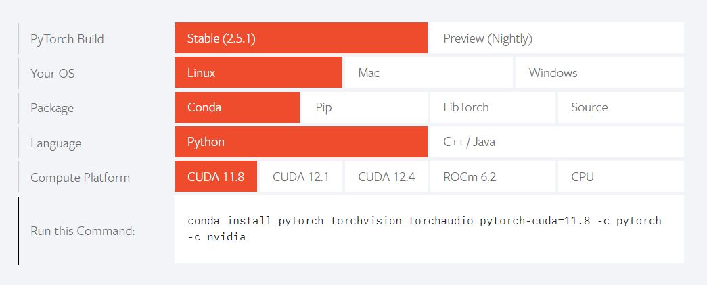

# Movie Recommender Chatbot

## About
Here is an implementation of a chatbot which can recommend you a movie based on your query.

Currently it uses Microsoft's [Phi-3.5-mini-instruct](https://huggingface.co/microsoft/Phi-3.5-mini-instruct) as a main model for text generation.
On average it takes from 30 seconds to a minute to get a response on a single RTX 4080 using 8-bit quantization.

Model takes your input, retrieves all important information, such as description, genres and so on, and then selects some movies
from Kaggle IMDB dataset using RAG (Retrieval Augmented Generation), finally giving you a short recommendation.

As a sentence transformer model currently we use [all-mpnet-base-v2](https://huggingface.co/sentence-transformers/all-mpnet-base-v2).
If you want to use an another model, don't forget to recalculate all embeddings in the dataset.

### Note:

**The chatbot is a bit raw at the moment, but is being actively developed. There are plans to make major changes.**

## Installation
#### 1. Clone the repository:
```bash
git clone https://github.com/chesswondo/movie-recommender-chatbot
```
Then navigate to "src" folder and don't forget to set pythonpath at it to use the modules.

#### 2. _[Install PyTorch](https://pytorch.org/)_ in your virtual environment according to your system.
[](https://pytorch.org)

#### 3. Install the rest of the dependencies:
```bash
pip install -r requirements.txt
```

## Calculating embeddings
Before using the program you may need to calculate embeddings for the dataset. Here is the script for doing it in "scripts" folder. So first navigate to it.
Then you can use the next script:
```bash
python embeddings_retriever.py \
  <option> --input_file
  <option> --output_file
  <option> --device
```

Here you can change these flags if you want to select your custom .csv dataset file or store the embeddings under the different .pkl path.
However, the program will work correctly if you simply run the script as follows:
```bash
python embeddings_retriever.py
```

## Usage
To use the program, you can then just navigate to the "src" folder and run the next script:
```bash
python main.py
```

**Here is an example of how it should look like:**


